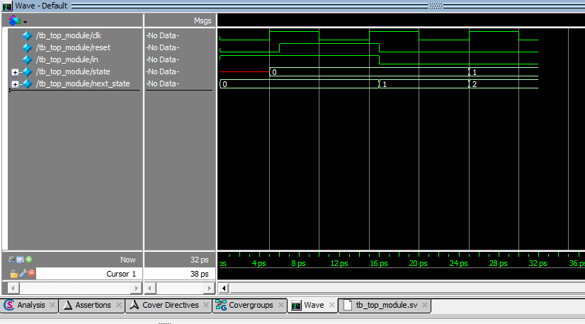

## Table of Contents

- [Table of Contents](#table-of-contents)
- [1. Clk-to-Q (t\_cQ)](#1-clk-to-q-t_cq)
- [2. Setup and Hold](#2-setup-and-hold)
- [3. Critical Path](#3-critical-path)
- [4. Slack](#4-slack)
- [5. Fmax](#5-fmax)

---

## 1. Clk-to-Q (t_cQ)


```
clk      ─────┐    ┌────
              └────┘
                   ▲
                   posedge

state    ──── 0 ─────────── 1
                        ▲
                        updates AFTER posedge
```

The time between posedge clk firing and Q output updating.
```
In simulation:    ~0 (ideal flip-flop)
In real hardware: ~0.1-0.5ns
```

**Why `@(posedge clk); #1` in testbenches:**
`#1` lets the flip-flop output settle before sampling state.

**next_state updates before state:**
```
next_state  combinational (always_comb) → instant, no clock
state       sequential    (always_ff)   → one cycle behind
```

**Setup / Hold / Clk-to-Q chain:**
```
before posedge → data stable → setup time
after posedge  → data stable → hold time
after hold     → Q updates   → clk-to-Q
```

---

## 2. Setup and Hold


---

## 3. Critical Path


---

## 4. Slack


---

## 5. Fmax

