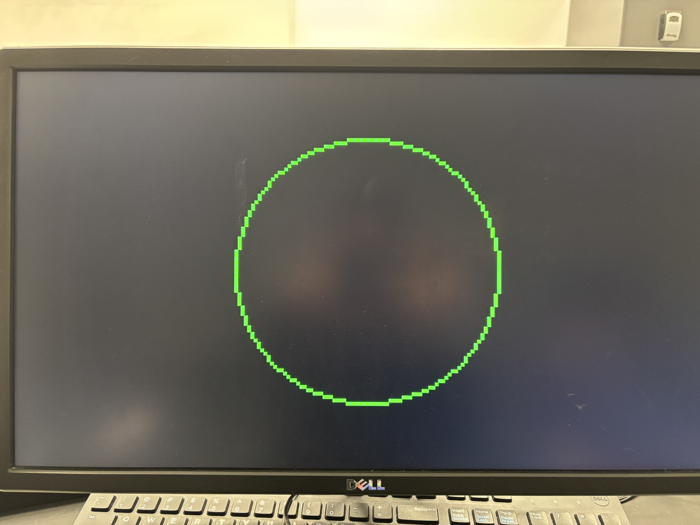
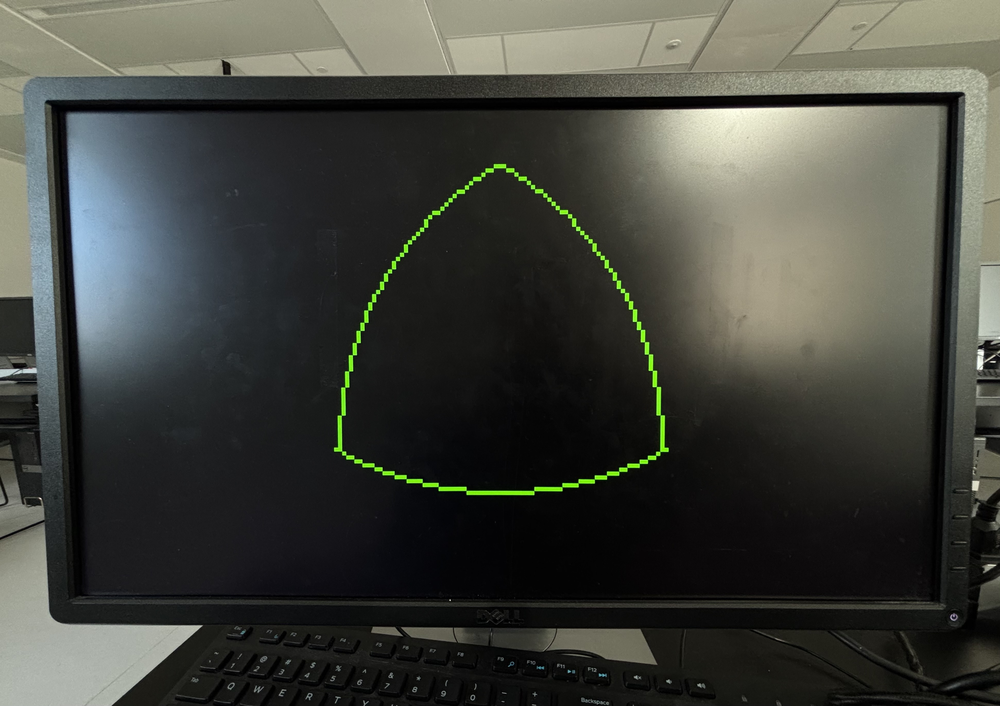

## VGA

Draws graphics on a 160x120 VGA display using a DE1-SoC and Quartus.

### Demos

  
  
  

### FSM Structure

All modules share the same 3-block FSM pattern:
- Input Combinational Logic
- Sequential State Register
- Output Combinational Logic

Additional helper tasks/functions and counters are used for implementing the algorithm and drawing logic.

### Testbenches

Each module has a manual coverage testbench tracking state and transition coverage, including a cycle count for timing constraints.