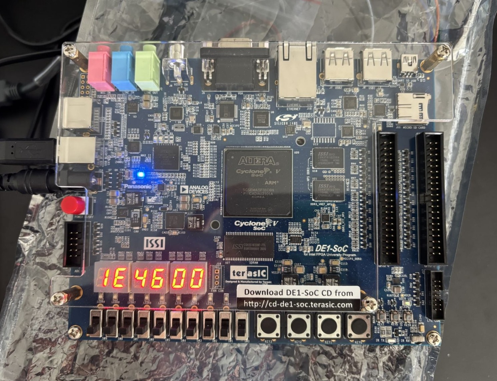
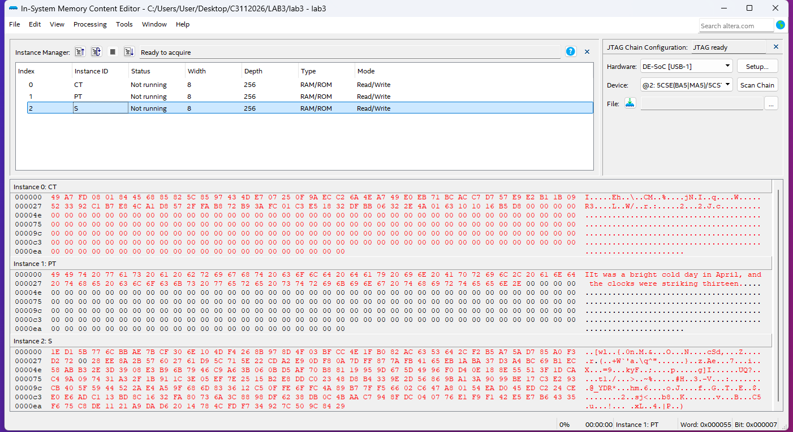

## ARC4 Cipher 

Implements ARC4 cipher.

- `init` 
  - initializes a 256-byte S-box with `s[i] = i`

- `ksa`
  -  Key Scheduling Algorithm, scrambles the S-box using the 24-bit key
  
- `prga` 
  - Pseudo-Random Generation Algorithm, XORs the keystream against ciphertext to produce plaintext
  
- `crack` 
  - cycles through 24-bit key space [0x000000, 0xFFFFFF], 
  - runs ARC4 pipeline for each candidate key.
  - The key is then displayed on the HEX displays of the DE1-SoC.

- `doublecrack` 
  - runs two `crack` cores in parallel. 
  - Splits the key space into even and odd. 
  - Reduces the search time roughly in half. 
  - The key is then displayed on the HEX displays of the DE1-SoC.

### Demos

  
  

<!-- ### FSM Structure
All modules use a 3-block Moore FSM:
- Input Combinational Logic → Sequential State Register → Output Combinational Logic
- Each ARC4 stage (init, ksa, prga) is a separate FSM chained inside `ARC4`
- `crack` loops the full ARC4 pipeline once per candidate key until a valid plaintext is found

### Testbenches
RTL testbenches verify state and transition coverage, cycle counts, and plaintext correctness
against golden reference outputs generated from python implementation of ARC4. -->

### Note
Completed in a team of two. Shared with permissions.